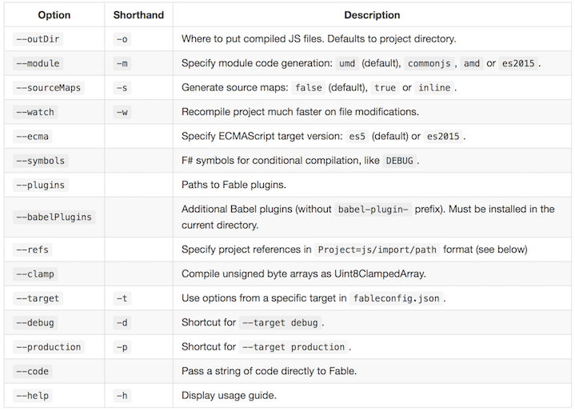

- title : Fable, the compiler that emits JS you can be proud of!
- description : Introduction to Fable, F# to JS compiler
- author : Alfonso Garcia-Caro
- theme : night
- transition : default


***


### Fable: the compiler that emits JS you can be proud of! 
Bringing together the F# and JS worlds

<div>
  
  <span style="white-space: pre">   meets   </span>
  
</div>

---


### ABOUT ME

Alfonso Garcia-Caro

- Author of Fable
- Spanish, also lived in Japan and Germany
- Degree in Linguistics
- .NET (C#/F#) and JS developer
- Developed desktop, mobile and web apps for videogame,
  green energy and education industries


***


### FABLE MAIN FEATURES

- Compiles F# source code to JavaScript
- Powered by the [F# compiler](http://fsharp.github.io/FSharp.Compiler.Service/) and [Babel](http://babeljs.io)
- Compatible with [most of FSharp.Core and some .NET BCL](http://fable-compiler.github.io/docs/compatibility.html)
- Source maps for F# code debugging
- Generates clean JS code
- No runtime, framework agnostic
- Adheres to ES6 standards: modules, iterables...
- Compatible with many JS development tools: Webpack, React, Redux...
- Web, Node, Desktop (Electron) and Mobile (React Native, Fuse)
- Extensible through [plugins](http://fable-compiler.github.io/docs/plugins.html)
- Young but growing [ecosystem](https://www.github.com/fable-compiler)


***


### F# MAIN FEATURES

- Static typing

> Dynamic programming also possible with Fable

- Comprehensive core library: [fable-core](https://www.npmjs.com/package/fable-core)

> Strings, DateTime, Collections, Async, Observables... in 20KB gzipped

- Functional programming

> Also powerful OOP features

- Great editor support

> Visual Studio, Xamarin, Ionide (VS Code, Atom), Emacs


---


### F# COMPATIBILITY WITH FABLE

- Records, Unions and Tuples
- Structural Equality and Comparison
- Comprehensions (seq, array, list)
- Computation Expressions
- Pattern Matching and Active Patterns
- Object Expressions
- Units of Measure
- Type Providers (must be written for Fable)

Check the [documentation](http://fable-compiler.github.io/docs/compatibility.html) for more info


***


### HELLO WORLD!

    [lang=shell]
    mkdir temp
    cd temp
    npm init --yes
    npm install -g fable-compiler
    npm install --save fable-core
    echo "printfn \"Hello World!\"" > hello.fsx
    fable hello.fsx
    node hello.js


---


### Compiler options

[Tailor compilation](http://fable-compiler.github.io/docs/compiling.html#CLI-options) to your needs:



---


### [fableconfig.json](https://github.com/fsprojects/Fable/blob/master/docs/compiling.md#fableconfigjson)

    [lang=json]
    {
        "module": "commonjs",
        "outDir": "out",
        "sourceMaps": true,
        "projFile": "src/Fable.Samples.React.fsproj",
        "scripts": {
            "prebuild": "npm install",
            "postbuild": "node node_modules/webpack/bin/webpack"
        },
        "targets": {
            "debug": {
                "watch": true,
                "symbols": ["DEV_SERVER"],
                "scripts": { "postbuild": "" }
            },
            "production": {
                "scripts": {
                    "postbuild": "node node_modules/webpack/bin/webpack -p"
                }
            }
        }
    }


---


### TESTING

NUnit or Visual Studio tests can be compiled to JS too

    #r "../../../packages/NUnit/lib/nunit.framework.dll"
    #load "util/util.fs"

    open NUnit.Framework

    [<Test>]
    let ``Util.reverse works``() =
        let res = Util.reverse "yllihP"
        Assert.AreEqual("Philly", res)


---

Compile the tests using NUnit plugin and run them with Mocha

    [lang=text]
    fable samples/node/console/tests.fsx -m commonjs
        --outDir out --plugins build/plugins/Fable.Plugins.NUnit.dll

    node build/tests/node_modules/mocha/bin/mocha
        samples/node/console/out/tests.js

***
- data-transition:concave


### INTERACTING WITH JS

We don't want to just intrude the JS ecosytem,
we want to take advantage of its full potential.

<p class="fragment fade-in">
Because .NET community is <strong>great</strong>
</p>

<p class="fragment fade-in">
F# community is <strong>fantastic</strong>
</p>

<p class="fragment fade-in">
JS community is...
</p>

<p class="fragment fade-in" style="font-size: 6em">
<strong>HUGE</strong>
</p>

<p class="fragment fade-in">
...and amazing too :)
</p>


---
- data-transition:concave


### DYNAMIC PROGRAMMING WITH FABLE

    open Fable.Core

    printfn "Value: %O" jsObj?myProp    // Property access

    jsObj?myProp <- 5                   // Assignment

    let x = jsObj?myMethod(1, 2)        // Application

    let y = createNew jsCons (1, 2)     // Apply `new` keyword

    let data =                          // JS literal object
        createObj [
            "todos" ==> Storage.fetch()
            "newTodo" ==> ""
            "editedTodo" ==> None
            "visibility" ==> "all"
        ]


---
- data-transition:concave


### JS MACROS

Use `Emit` attribute to emit JS code directly

    open Fable.Core

    [<Emit("$0 + $1")>]
    let add (x: int) (y: string): float = failwith "JS only"

    type Test() =
        // Rest arguments
        [<Emit("$0($1...)")>]
        member __.Invoke([<ParamArray>] args: int[]): obj =
            failwith "JS only"

        // Syntax conditioned to optional parameter
        [<Emit("$0[$1]{{=$2}}")>]
        member __.Item
            with get(): float = failwith "JS only"
            and set(v: float): unit = failwith "JS only"


---
- data-transition:concave


### SPECIAL ATTRIBUTES

- Erased Union Types
- String Literal Types
- Key-Value Lists

```fsharp
[<Erase>]
type MyErasedType =
    | String of string | Number of int

[<StringEnum>]
type MyStrings =
    | Vertical | Horizontal

[<KeyValueList>]
type MyOptions =
    | Flag1 | Name of string | [<CompiledName("QTY")>] QTY of int
```

---
- data-transition:concave


### FOREIGN INTERFACES

Define foreign interfaces easily to get the benefits of static checking and Intellisense

    [<Import("*","string_decoder")>]
    module string_decoder =
        type NodeStringDecoder =
            abstract write: buffer: Buffer -> strings
            abstract detectIncompleteChar: buffer: Buffer -> float

        let StringDecoder: NodeStringDecoder = failwith "JS only"


Use `Import` attribute to [import external JS modules in ES2015 fashion](https://github.com/fsprojects/Fable/blob/master/docs/interacting.md#import-attribute)

---
- data-transition:concave
- class:line-height-150


- Native JS, Browser and Node interfaces are included in [fable-core](https://www.npmjs.com/package/fable-core)
- More definitions can be found in npm: [fable-import-xxx](https://www.npmjs.com/search?q=fable-import)
- A TypeScript parser is also available: [ts2fable](https://www.npmjs.com/package/ts2fable)

> Bindings generated by `ts2fable` often require some manual editting


***


### MADE WITH FABLE


***

### Thanks for listening!

Questions?

http://fable-compiler.github.io

Don't forget to star the project on [GitHub](https://github.com/fable-compiler/Fable)!

<div style="text-align: right">
  <p>Follow us on Twitter!</p>
  <p>@FableCompiler</p>
  <p>@alfonsogcnunez</p>
</div>
